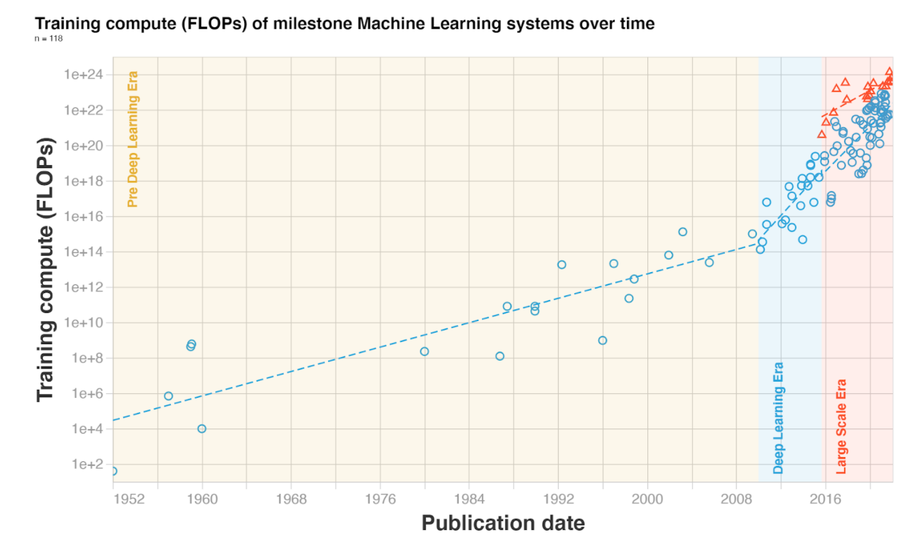

What do you need to develop advanced Machine Learning systems? Leading companies don’t know. But they are very interested in figuring it out. They dream of replacing all these pesky workers with reliable machines who take no leave and have no morale issues. 

So when they heard that [throwing processing power at the problem might get you far along the way](https://arxiv.org/abs/2001.08361), they did not sit idly on their GPUs. But, how fast is their demand for compute growing? And is the progress regular?

Enter us. We have [obsessively analyzed](https://arxiv.org/abs/2202.05924) trends in the amount of compute spent training milestone Machine Learning models.

Our analysis shows that:

* **Before the Deep Learning era**, training compute approximately followed Moore’s law, doubling every ≈20 months.
* The **Deep Learning era** starts somewhere between 2010 and 2012. After that, doubling time speeds up to ≈5-6 months.
* Arguably, between 2015 and 2016 a separate **trend of large-scale models** emerged, with massive training runs sponsored by large corporations. During this trend, the amount of training compute is 2 to 3 orders of magnitude (OOMs) bigger than systems following the Deep Learning era trend. However, the growth of compute in large-scale models seems slower, with a doubling time of ≈10 months.



![Table 1. Doubling time of training compute across three eras of Machine Learning.  The notation [low, median, high] denotes the quantiles 0.025, 0.5 and 0.975 of a confidence interval.](images/table1.png)

Not enough for you? Here are some fresh takeaways:

* Trends in compute are **slower than** [previously reported](https://openai.com/blog/ai-and-compute/)! But they are [still ongoing](https://www.lesswrong.com/posts/wfpdejMWog4vEDLDg/ai-and-compute-trend-isn-t-predictive-of-what-is-happening). I’d say slow and steady, but the rate of growth is blazingly fast, still doubling every 6 months. This probably means that you should double the timelines for all [previous analyses]() that relied on AI and Compute’s previous result.
* We think the framing of the **three eras of ML** is very helpful! Remember, we are suggesting to split the history of ML into the **Pre-Deep Learning Era**, the **Deep Learning Era** and the **Large-Scale Era**. And we think this framing can help you make sense of what has happened in the last two decades of ML research.
* We have curated an awesome [public database of milestone ML models](https://docs.google.com/spreadsheets/d/1AAIebjNsnJj_uKALHbXNfn3_YsT6sHXtCU0q7OIPuc4/edit#gid=0)! Please use it for your own analyses (don’t forget to cite us!). If you want to play around with the data, we are maintaining an interactive visualization of it [here](https://colab.research.google.com/drive/11m0AfSQnLiDijtE1fsIPqF-ipbTQcsFp) and a crappier but ligther one [here](https://eirol.github.io/trends/crappy-visualization/visualization.html).
 

Compute is a strategic resource for developing advanced ML models. Better understanding the progress of our compute capabilities will help us better navigate the advent of transformative AI.

In the future, we will also be looking at the other key resource for training machine learning models: data. [Stay tuned for more](https://www.alignmentforum.org/s/T9pBzinPXYB3mxSGi?_ga=2.94622108.1499606200.1645194489-71379542.1628068400)!

_[Read the full paper now on the arXiv](https://arxiv.org/abs/2202.05924)_

```{r setup, include=FALSE}
knitr::opts_chunk$set(echo = FALSE)

# Learn more about creating websites with Distill at:
# https://rstudio.github.io/distill/website.html

```

